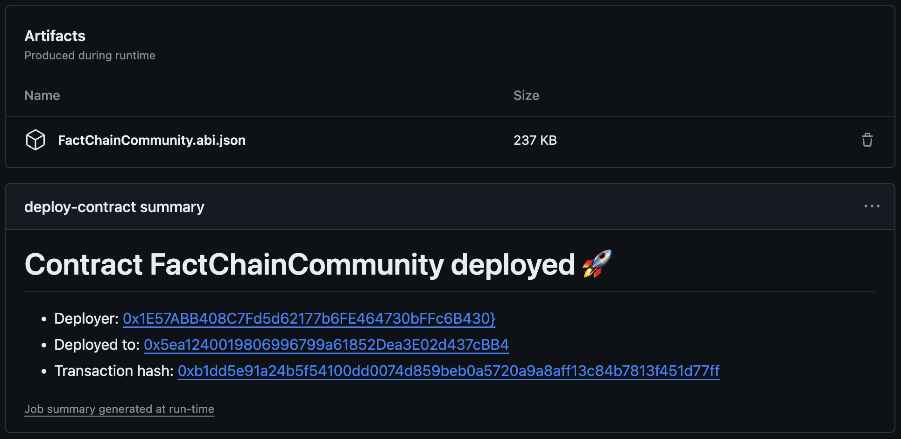

# Deploy EVM smart contract

This action deploys a smart contract using [forge](https://github.com/foundry-rs/foundry/tree/master/crates/forge).

You can specify the target EVM to use, and can also trigger the verification of the contract on Etherscan.

The action generates a report of the deployment and verification, then adds the ABI of the contract as an artifact on your action run.



# Examples

```yaml
name: Deploy main contract
on:
  push:
    branches: [ main ]
jobs:
  deploy-contract:
    runs-on: ubuntu-latest
    permissions: write-all
    steps:
      - uses: actions/checkout@v3
      - uses: YBadiss/deploy-contract@v1
        with:
          contract-name: 'OwnableContractName'
          parent-dir: 'dir-of-all-contracts'
          chain-id: '11155111'
          rpc-url: ${{ secrets.RPC_ETH_SEPOLIA_HTTPS }}
          deployer-pk: ${{ secrets.DEPLOYER_PK }}
          constructor-args: '${{ vars.OWNER_ADDRESS }}'
          verify: true
          etherscan-url: 'https://sepolia.etherscan.io'
          etherscan-api-key: ${{ secrets.ETHERSCAN_SEPOLIA_API_KEY }}
```

# Dependencies and requirements

- You must have checked out the code using the [standard checkout action](https://github.com/actions/checkout).
- Installing the latest version of `forge` is performed using the action [foundry-toolchain](https://github.com/foundry-rs/foundry-toolchain).
- Your code must be in a `src` folder, under the [`parent-dir` input](#parent-dir).

# Inputs

### contract-name

Name of the contract to deploy.

Must be the name of the main sol file, and of the target constract class.

- `REQUIRED`

### chain-id

ID of the chain to deploy to. If in doubt see https://chainlist.org/.

- `REQUIRED`

### rpc-url

URL of the RPC to use to deploy the contract.

- `REQUIRED`
- :warning: Use github secrets if the URL embeds an API Key.

### deployer-pk

Private key to use for deployment, in hex format.

- `REQUIRED`
- :warning: Use github secrets.

### parent-dir

Parent directory of `src` and `out`.

- `OPTIONAL, DEFAULT="."`

### constructor-args

Arguments to pass to the contract's constructor.

- `OPTIONAL, DEFAULT=""`

### verify

Whether to verify the contract or not on Etherscan.
If set to `true`, [etherscan-url](#etherscan-url) and [etherscan-api-key](#etherscan-api-key) are required.

- `OPTIONAL, DEFAULT="false"`

### etherscan-url

URL of the etherscan endpoint to use for verification and reporting.

- `OPTIONAL, DEFAULT=""`

### etherscan-api-key

API key used for verification.

- `OPTIONAL, DEFAULT=""`
- :warning: Use github secrets.

# License

The scripts and documentation in this project are released under the [MIT License](LICENSE)
